# Lemur Light Effect Card

**[Türkçe](README.md)** · English

A Home Assistant dashboard card for light effects, white tones and colors that works with **any light brand**: Govee, Philips Hue, WLED, Yeelight, LIFX, Tuya and anything else that exposes `effect_list`.

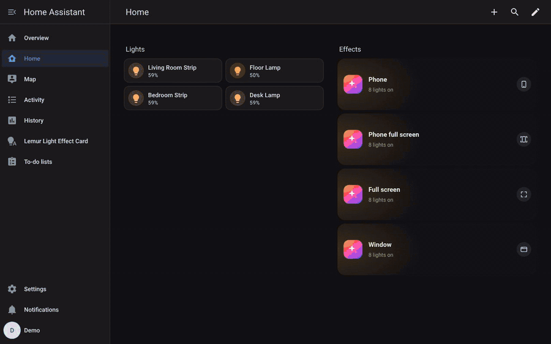

**Quick install:** [open in HACS](https://my.home-assistant.io/redirect/hacs_repository/?owner=mendebur-lemur&repository=lemur-light-effect-card&category=integration) → Download → restart Home Assistant → [add the integration](https://my.home-assistant.io/redirect/config_flow_start/?domain=lemur_light_effects). Step-by-step guide with videos [below](#install).

- **Rooms come from Home Assistant areas.** No YAML light lists. Pick which lights in a room receive effects, and the choice is shared by the whole household.
- **Mixed brands in one room.** Every effect from every selected light is shown. Dots under a tile show how many lights support it, and tapping it sends the effect only to those lights. Equivalent effects are merged (Hue `candle`, WLED `Candle` and Govee `Candlelight` become one tile).
- **Every room has its own tabs, favorites and hidden effects.** Long-press an effect on the card (right-click on desktop) to favorite it, hide it, or upload your own icon.
- **A hand-drawn icon for every effect.** Hundreds of effects each have their own icon in one consistent style; for unknown names the closest match is picked from the effect name.
- **One Stop button for every brand.** It sends each light's own "off" effect, then a calm white (default 3200 K, 40 %) instead of full-bright white.
- **Light tab** with a brightness bar, white tones, a color wheel and swatches.
- **Tablet and phone layouts.** On a phone everything sits under your thumb: a room box at the top (every room and how many lights are on, one tap away), what is playing with a Stop button right below it, and at the bottom a wide brightness bar and the Favorites / Recently played / All effects / White & colour tabs. The All effects tab has search. Swipe left or right to change rooms. Updates are optimistic, so taps feel instant.
- **Four ready-made button cards:** phone screen, phone full screen, full screen and a resizable window. None of them needs browser_mod.
- **Create your own effects.** Drag lights into an effect and choose what each opens: lights without the effect switch to a colour or white, any light can play another effect from its own list.
- **Control panel in the sidebar** (*Lemur Light Effect Card*): arrange rooms, lights, tabs and effects by drag and drop.
- **Plenty of settings:** tile size, colour or simple icons, black (OLED) or theme background, night mode, start tab, room icons and more. Effects and favorites become Home Assistant scripts in one click.
- **Automations and voice assistants:** an effect select entity per room and the `lemur_light_effects.play` action.
- Turkish, English, German, Spanish and French.

## Contents

- [Install](#install)
  - [1. Download with HACS](#1-download-with-hacs)
  - [2. Add the integration](#2-add-the-integration)
  - [3. Arrange your rooms in the control panel](#3-arrange-your-rooms-in-the-control-panel)
  - [4. Add the card to a dashboard](#4-add-the-card-to-a-dashboard)
- [Ready-made button cards](#ready-made-button-cards)
- [Updating](#updating)
- [Troubleshooting](#troubleshooting)
- [Screenshots](#screenshots)
- [Control panel](#control-panel)
  - [Settings](#settings)
  - [Create effect](#create-effect)
  - [Fill in the missing lights](#fill-in-the-missing-lights)
- [Automations, scripts and voice assistants](#automations-scripts-and-voice-assistants)
- [Card options](#card-options)
- [The Lemur family](#the-lemur-family)

## Install

You need Home Assistant 2024.1 or newer and [HACS](https://hacs.xyz/docs/use/). No other cards, themes or add-ons are required.

### 1. Download with HACS

The easiest way is this button. It asks for your Home Assistant address once, then opens the repository in HACS:

[](https://my.home-assistant.io/redirect/hacs_repository/?owner=mendebur-lemur&repository=lemur-light-effect-card&category=integration)

1. Press **Add** in the dialog (the repository is added to HACS).
2. Press **Download** at the bottom right, then **Download** again in the version dialog.
3. **Settings → System → ⏻ at the top right → Restart Home Assistant**. A "Restart required" notice also appears on the Settings page; you can restart from there too.

<details>
<summary>If the button doesn't work: add it manually</summary>

1. Open **HACS** from the sidebar.
2. **⋮** menu at the top right → **Custom repositories**.
3. Paste this address into **Repository**:
   `https://github.com/mendebur-lemur/lemur-light-effect-card`
4. Choose **Integration** as **Type** and press **Add**. Close the dialog.
5. Type **Lemur Light Effect Card** into the HACS search box and open the result.
6. **Download** → **Download**, then restart Home Assistant.

</details>

### 2. Add the integration

[](https://my.home-assistant.io/redirect/config_flow_start/?domain=lemur_light_effects)

Without the button: **Settings → Devices & services → Add integration** → type "Light" or "Lemur" → **Lemur Light Effect Card** → **Submit** → **Finish**. There are no questions; your lights are found automatically.

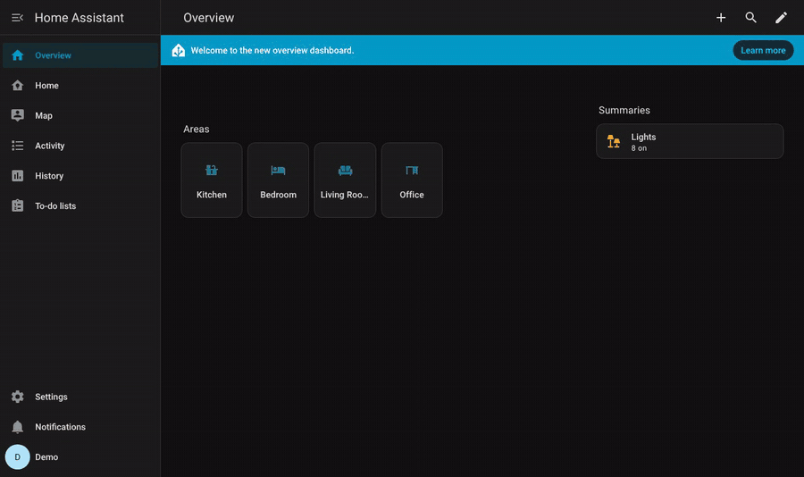

### 3. Arrange your rooms in the control panel

**Lemur Light Effect Card** appears in the sidebar (admins only). On first open every room is filled automatically from its lights, so you can use it without touching anything. If you like:

- Drag effects between tabs. Dropping on **Favorites** stars an effect, dropping on **Hidden** hides it in the card.
- Click a light to move it to another room, hide it in the card, or switch **Use for effects** on or off.
- Made a mistake? **Undo** (or Ctrl+Z).

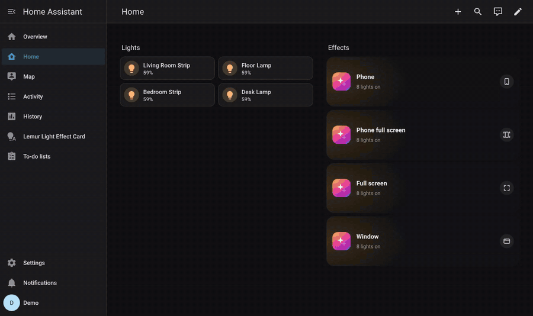

### 4. Add the card to a dashboard

1. Open your dashboard and press the **✏️ (Edit)** button at the top right.
2. Press **+** in a section and type **Lemur** into the search box.
3. Pick a card (one of the [ready-made button cards](#ready-made-button-cards) below, or the card itself), press **Save**, then **Done** at the top right.

The card registers itself; you don't need to add anything under *Resources*. The video adds the **Full screen button**:

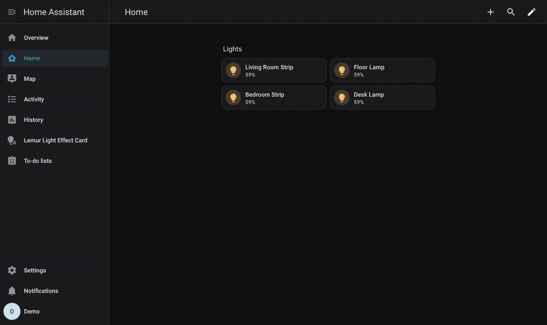

To add the card itself in YAML:

```yaml
type: custom:lemur-light-effect-card
```

## Ready-made button cards

These sit on the dashboard as a small button and open the effects screen when tapped. All four work without browser_mod or any other add-on, and close with the phone's back button, Esc or ✕. In the card picker they are listed as **Lemur Light Effect Card · …**.

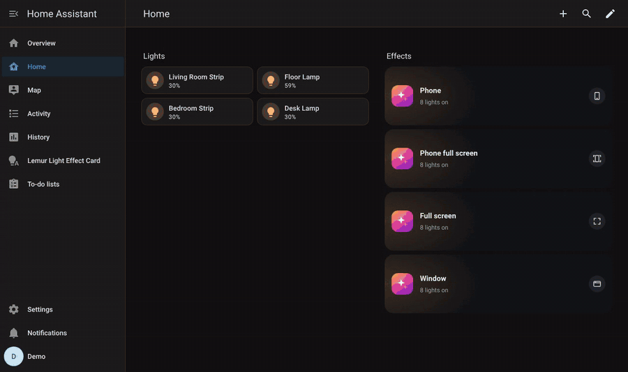

| Card | What it opens | Best for |
|---|---|---|
| **Phone button** (`custom:lemur-phone-button`) | A screen laid out for phones. Fills the whole screen on a phone, and becomes a phone-sized window in the middle on wider screens. | Quick use from a phone |
| **Phone full screen button** (`custom:lemur-phone-fullscreen-button`) | The phone layout. On a phone it also turns on the browser's full screen mode (address and system bars hidden); on wider screens it is a phone-sized window in the middle. | The most room on a phone |
| **Full screen button** (`custom:lemur-fullscreen-button`) | The effects screen over the whole display. Also turns on the browser's own full screen mode, hiding the address bar and menus. | Wall tablets, tablets and phones |
| **Window button** (`custom:lemur-window-button`) | A window whose size, position and corners you choose. The content scales proportionally with the window. | Desktop, large screens, custom layouts |

Every option is in the visual editor. YAML examples:

```yaml
type: custom:lemur-phone-button
name: Lights
```

```yaml
type: custom:lemur-phone-fullscreen-button
name: Lights
style: tile
color: purple
color_icon: aurora
```

```yaml
type: custom:lemur-fullscreen-button
name: Light effects
browser_fullscreen: true
```

```yaml
type: custom:lemur-window-button
name: Light effects
popup_width: 1100
popup_height: 700
popup_position: center
popup_radius: 24
popup_blur: true
popup_scale: true
aspect: 16/10
```

| Option | Card | Default | Description |
|---|---|---|---|
| `name` | all | Lemur Light Effect Card | Button title |
| `subtitle` | all | number of lights on | Button subtitle |
| `hash` | all | `isik-telefon` / `isik-mobil` / `isik-efektleri` / `isik-pencere` | The `#...` added to the address while open. Any link to that address (another button, a notification, an automation) opens the screen. |
| `browser_fullscreen` | full screen, phone full screen | `true` | Also turn on the browser's full screen mode (on the phone full screen button: only on phones) |
| `popup_width` / `popup_height` | window | `min(1280px,94vw)` / `min(800px,88vh)` | Window size. Plain numbers are pixels; CSS values such as `90vw` or `70%` work too. |
| `popup_position` | window | `center` | `center` or `bottom` (slides up from the bottom) |
| `popup_radius` | window | `24` | Corner radius (px) |
| `popup_blur` | window | `true` | Blur the dashboard behind the window |
| `popup_scale` | window | `true` | Scale the content to the window. With `false` the card fills the window at normal size. |
| `aspect` | window | `16/10` | Aspect ratio used for scaling |
| `style` | all | `row` | Button style: `row` (icon, title, subtitle), `tile` (big icon, title below), `icon` (icon only) |
| `color` | all | orange-purple gradient | Button colour: a Home Assistant colour name (`blue`, `purple`, `primary` …) or `#hex` |
| `color_icon` | all | – | A colour icon from the effect icons (e.g. `aurora`, `fire`, `party`); picked from a list in the visual editor |
| `icon` | all | – | A Home Assistant icon (e.g. `mdi:lightbulb-group`); `color_icon` wins if both are set |

Style, colour and icon are picked in the **Appearance** section of the card's visual editor:

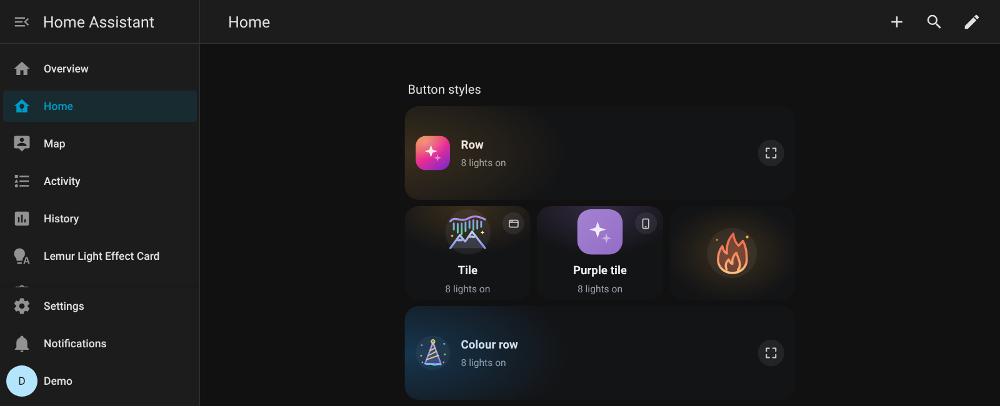

Every [card option](#card-options) can be added to these cards too (for example `areas`, `kelvin`, `accent`); it is passed on to the screen they open.

## Updating

The easiest way is the control panel: **Settings → Version and updates → Check for updates**. If there is a new version, **Update** downloads it through HACS and **Restart** restarts Home Assistant; when it is back the page moves to the new version by itself.

To do it by hand:

1. **HACS → Lemur Light Effect Card → ⋮ → Update information**, then **Download** (or **Update** in the notification under Settings). HACS looks at custom repositories on its own only every 48 hours; "Update information" does it right away.
2. Restart Home Assistant.

The card clears old page copies kept by the browser and the phone app itself; if an old card loads once, the page reloads once. Coming from a version older than 1.4.0, press Ctrl+F5 once on a computer, and in the phone app use **Settings → Companion app → Reset frontend cache**.

Your rooms, tabs, favorites and icons are kept across updates.

## Troubleshooting

- **Nothing shows up when you search "Lemur" in the card picker, or you see "Custom element doesn't exist".** Make sure the integration has been added ([step 2](#2-add-the-integration)) and Home Assistant has been restarted, then refresh the browser with Ctrl+F5.
- **No Lemur Light Effect Card in the sidebar.** The panel is visible to admin users only. The card works for everyone.
- **One light narrows the effect list, or effects seem to be missing.** For example a light added through Matter, or one that only has white tones. Click that light in the control panel and turn **Use for effects** off. It keeps working for color, white tone and brightness, but no longer affects the effect list.
- **A light doesn't show up at all.** It needs to be assigned to an area in Home Assistant; lights without an area are collected in the **Unassigned** room in the panel, and you can drag them to any room from there. Lights you hid in the card are under **Hidden in card** in the panel.
- **Full screen doesn't turn on, it only fills the page.** Some browsers (such as Safari on iPhone) don't let web pages go full screen. The screen still covers the whole page, but the address bar stays.
- **Still stuck?** [Open an issue](https://github.com/mendebur-lemur/lemur-light-effect-card/issues) and include your Home Assistant version and browser.

## Screenshots

| Tablet | Phone |
|---|---|
| 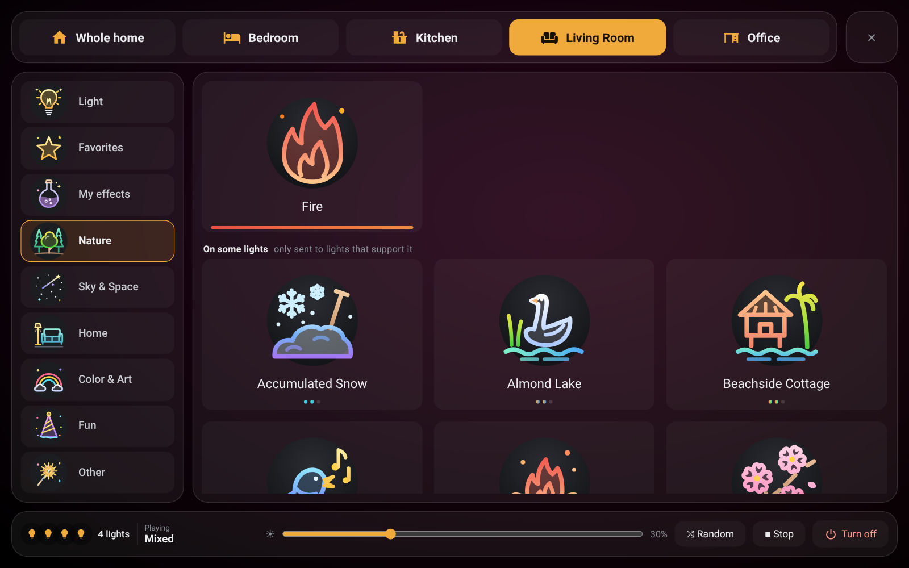 | 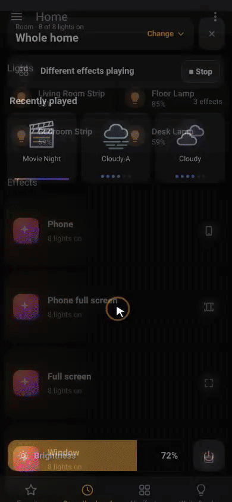 |
| 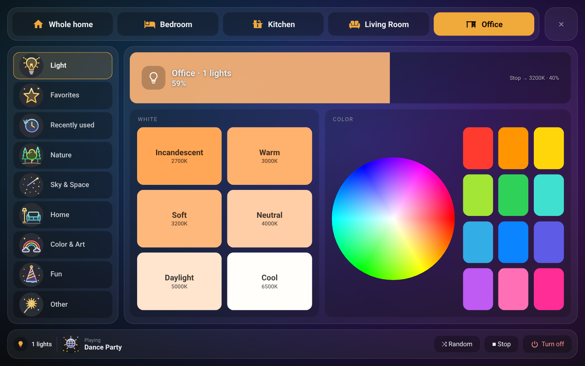 | |

## Control panel

Installing the integration adds an **Lemur Light Effect Card** page to the Home Assistant sidebar (admins only). The panel is the card in edit mode: rooms on top, the selected room's lights right below it, tabs on the left and effects on the right. Everything moves by drag and drop and applies to every card in the house.

- **Rooms and lights:** rooms come from Home Assistant areas. Drag a light onto another room or pick it with "Add light". Lights dropped on "Hidden in card" never show; segments, indicator LEDs and screens land there automatically. Drag rooms and "Whole home" to reorder them; Whole home can be turned off from its own strip.
- **Use for effects:** the menu that opens when you click a light decides whether that light is used for effects. Lights with it off are used only for color, white tone and brightness, and don't narrow the room's effect list.
- **Every room has its own tabs:** the tabs of a room and the effects in them belong to that room only. On first open every room is filled automatically from its lights. Drag effects between tabs; dropping on Favorites stars an effect, dropping on Hidden hides it in that room. "Add tab" offers an empty tab, ready-made groups and the tabs of other rooms; dragging a tab onto another room copies it.
- **Preview:** turn on **▶ Preview** in the top bar and the effect you click plays on the selected room's lights right away, so you can try effects one after another. The lights' state is saved when it starts. **Put lights back** in the bar restores them, **Keep it** leaves the last effect playing. Leaving the panel or 10 minutes without a click puts the lights back by themselves. Effects played in the preview don't go into "Recently played".
- **All effects:** every effect of the room in one grid, labelled with the tab it is in. Search, select (Shift for a range) and drag onto any tab. An effect's "⋯" button shows what each light calls it and lets you upload your own icon.
- **Undo:** every change can be undone (button or Ctrl+Z). The "⋯" menu resets a room to the automatic layout, hides a room in the card, or copies its tabs to other rooms.
- **Tab name and icon:** click a tab to rename it and pick one of the colour effect icons or a simple icon (with a search box).
- **Room icon:** give any room (Whole home and Unassigned too) its own icon from the "⋯" menu.
- **Save as script:** from an effect's "⋯" menu, or the button at the top of the Favorites tab, Home Assistant scripts are created that play the effect; use them in automations and voice assistants.

### Settings

The **Settings** window at the bottom left applies to every card at home:

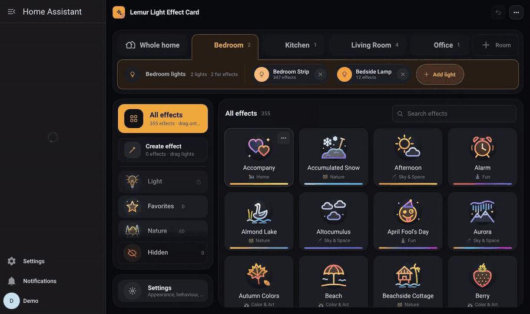

- *Appearance:* tile size (automatic, small, medium, large), colour or simple one-colour icons, background (dark, black OLED, Home Assistant theme), effect names, colour line and support dots on/off.
- *Bottom bar:* hide the Stop and Random buttons.
- *Behaviour:* the brightness a light that is off comes on at when an effect is picked, which tab the card opens on (last used, automatic, Favorites, Light; the default "last used" is the room and tab you last had open on that device), long press time, vibration, transition (colour, white, brightness and turning off change softly) and the **Recently used** tab (the last 12 effects played in the room, below Favorites).
- *After Stop:* white tone and brightness.
- *Night mode:* a brightness ceiling between two times (effects, Stop and the brightness bar never go above it).
- *Rooms and lights:* show Home Assistant light groups, the minimum number of effects a light needs.
- *Version and updates:* the installed version; check for a new one, download it with HACS and restart Home Assistant.
- *Backup:* download the whole setup (rooms, tabs, favorites, your own effects, settings, icons) as one file and restore it when you like.
- *Reset everything:* after a confirmation, deletes the whole layout, tabs, favorites, icons and your own effects.

### Create effect

In the panel, **Create effect** right below **All effects** lets you make your own effect:

1. Press **New effect** and pick a name and an icon.
2. Optionally pick a **base effect** (for example Movie). Lights that have it play it.
3. On the left, **every light** at home is listed by room. Drag the ones you want into **Lights in this effect** on the right (or add with +, or "Add all" for a whole room).
4. For each light on the right, choose what it does: **Automatic** (the base effect if it has it, otherwise the colour or white chosen above), another **effect** from its own list, a **colour**, a **white** tone or **turn off**; colour and white come with a brightness.

Once saved it shows in the card under **My effects** like any other effect; one tap and only the lights you added do their part. You can also drag your effects from the list onto any tab.

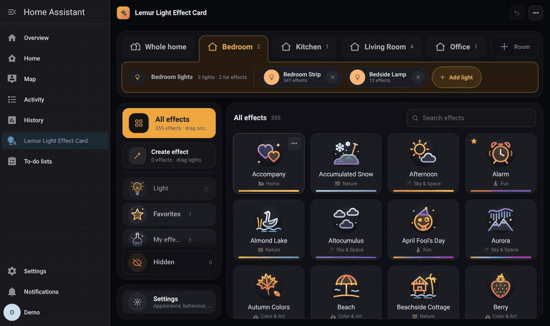

| Room layout | All effects |
|---|---|
| 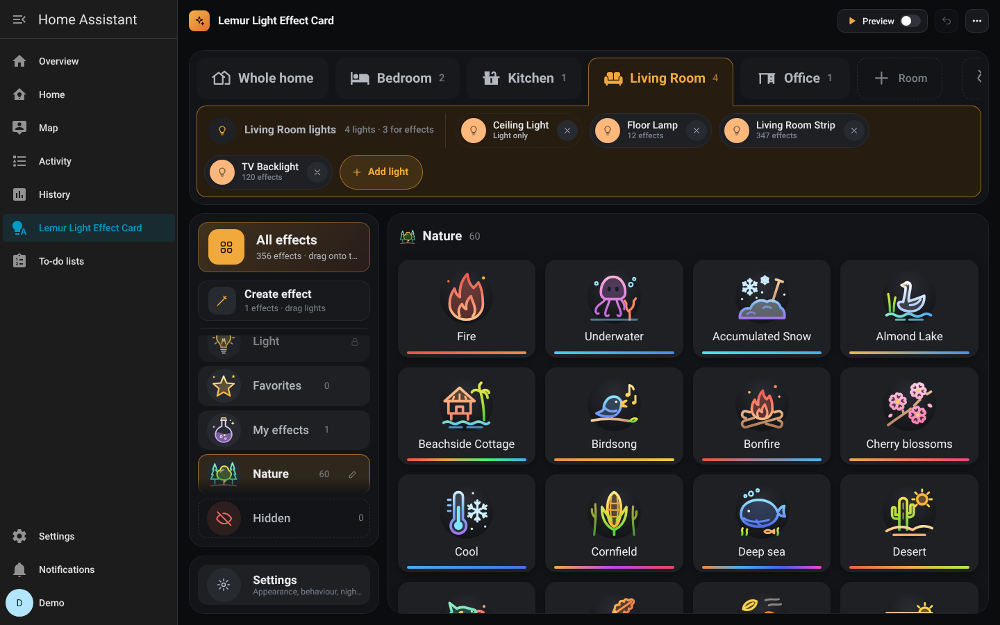 | 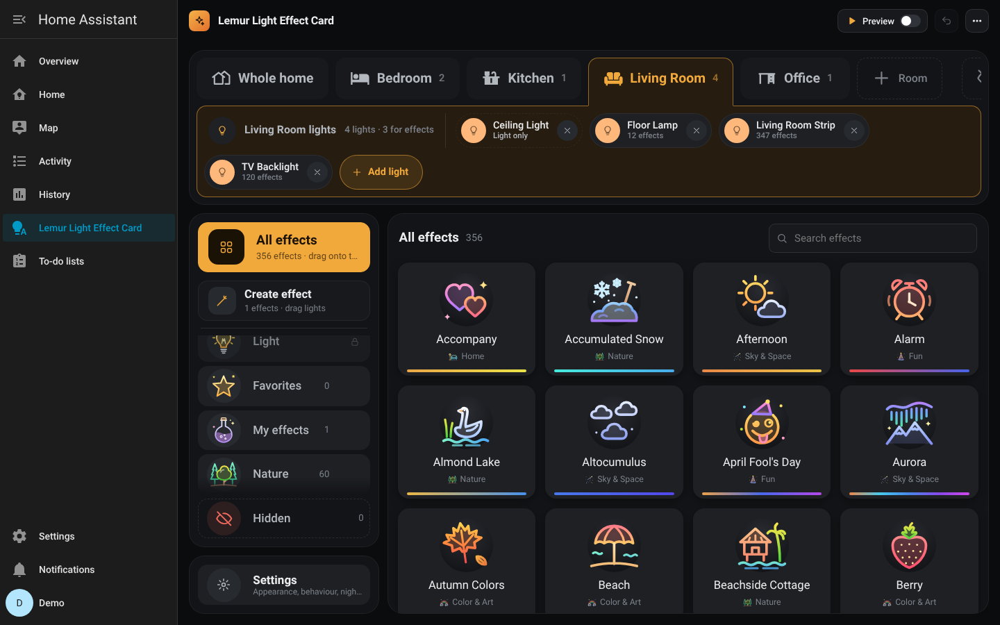 |
| **Settings** | **Create effect** |
| 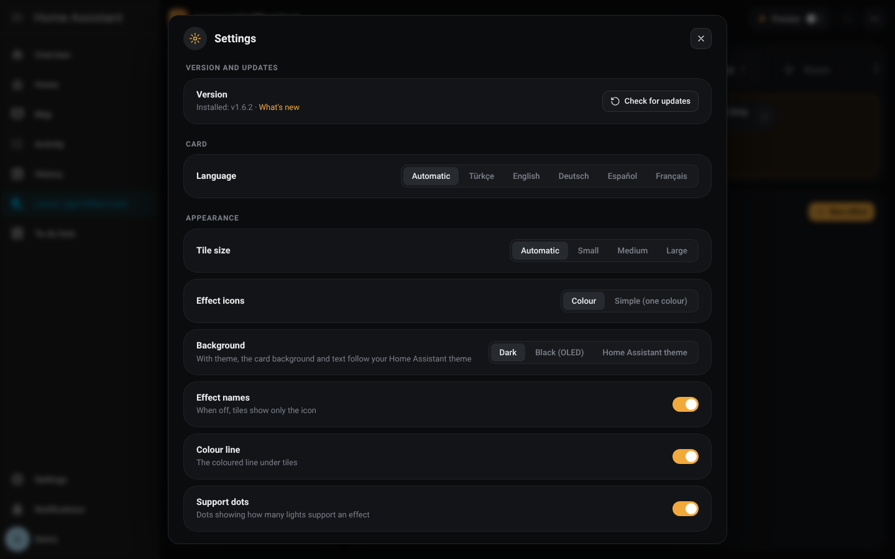 | 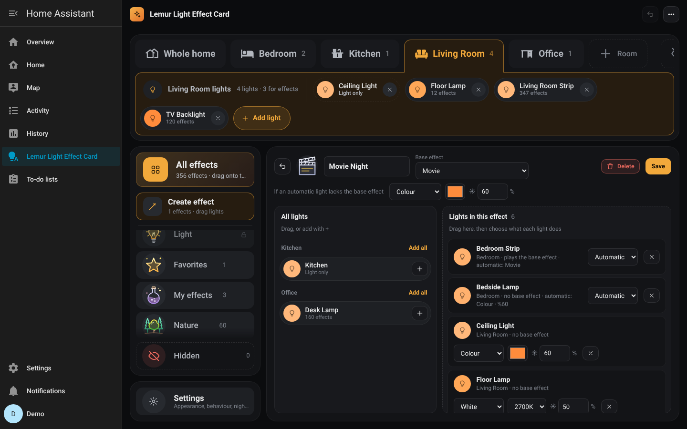 |

### Fill in the missing lights

When only some of the lights in a room have an effect, you can tell the others what to do. The effect then covers the whole room instead of half of it.

1. Right-click the effect on the card (long-press on a phone) and press **Fill in the missing lights**. The control panel opens on that effect. The effect's ⋯ menu in the panel leads to the same screen.
2. Lights with the effect are listed at the top, lights without it below, room by room.
3. Pick something in **For all**: a **colour**, a **white** tone, another **effect** from the light's own list, **turn off** or **leave as is**. Change any light on its own if you like, then **Save**.

When the effect plays, lights with it play it and the others do what you chose. A filled-in effect looks like a full effect on the card, with a small ✓ in its corner. Effect select entities and the `lemur_light_effects.play` action follow the same rule. Only admin accounts can open this screen.

In the card's **On some lights** section, effects that play on the most lights come first.

## Automations, scripts and voice assistants

Every room gets an **effect select** entity (like `select.lemur_living_room_effect`; `select.lemur_home_effect` for the whole home). It shows the effect playing in the room, plays the one you pick, and `—` works like Stop. Use it on dashboards, in automations and with voice assistants (Assist, Google, Alexa). The list has the effect names as the lights report them plus your own effects; the name the card shows is accepted too.

Actions:

```yaml
action: lemur_light_effects.play
data:
  room: living_room      # area ID or the room name the card shows; _all = whole home
  effect: Movie Night    # name on the light, name on the card, or one of your own effects
  brightness: 60         # optional, %
  transition: 2          # optional, seconds
```

```yaml
action: lemur_light_effects.stop
data:
  room: living_room
```

`lemur_light_effects.list_effects` (returns a response) gives the effects a room can play and the one playing now. The actions behave like the card: the lights chosen for the room, hidden effects, night mode and the "light that is off comes on at" setting all apply.

## Card options

All options are available in the visual editor. The control panel settings set their defaults; a value written on the card wins.

| Option | Default | Description |
|---|---|---|
| `areas` | all areas with lights | Area IDs to show, in this order |
| `exclude` | – | Lights to leave out |
| `entities` | – | Use only these lights (overrides area discovery filters) |
| `kelvin` / `brightness` | `3200` / `40` | What **Stop** and the power button switch to |
| `all_home` | `true` | Show a "Whole home" tab |
| `min_effects` | `3` | A light needs at least this many effects to be offered effects |
| `language` | `auto` | `auto`, `tr`, `en`, `de`, `es`, `fr` |
| `height` / `mobile_height` | `80vh` / `80vh` | Card height |
| `mobile` | auto (< 640 px) | Force the phone (`true`) or tablet (`false`) layout |
| `close` | `false` | Show a close button (when used inside another add-on's popup) |
| `accent` | `#F0A93B` | Accent color |
| `include_groups` | `false` | Also list light groups |

Hidden, entity-category and light-group entities are skipped automatically.

The integration stores the shared data (room tabs, favorites, room selections, hidden effects, last effect, recently used, icons) in `.storage/lemur_light_effects`. Uploaded icons are saved in `config/lemur_light_effects_icons/`. Without the integration, you can load the card as a plain resource (`/lemur_light_effects/lemur-light-effect-card.js` or a copy under `/local`; copy `lemur-icons.json` next to it). Its data is then saved only in that browser.

## How effects are grouped

In a room you have not arranged in the panel yet, names are normalized and matched against a small synonym table, then sorted into Nature, Sky & Space, Home, Color & Art, Fun and Other using keyword rules. For common scene names, a curated table adds Turkish names and colors. Effects named like "off", "none", "stop" or "solid" are treated as *no effect*.

## The Lemur family

Each one installs on its own; installed together, they work hand in hand.

| | What it does | Install |
|---|---|---|
| **[Lemur Home Dashboard](https://github.com/mendebur-lemur/lemur-home-dashboard)** | A ready-made tablet dashboard set up with one line, with its own admin panel. Rooms, lights, scenes, climate and media come from your areas on their own. When both are installed, the dashboard gets an Effects button in its top bar and effect buttons for scene sections. | [](https://my.home-assistant.io/redirect/hacs_repository/?owner=mendebur-lemur&repository=lemur-home-dashboard&category=integration) |
| **Lemur Light Effect Card** (this repository) | An effect screen that manages every effect-capable light room by room. | [](https://my.home-assistant.io/redirect/hacs_repository/?owner=mendebur-lemur&repository=lemur-light-effect-card&category=integration) |
| **[Lemur Halo Cards](https://github.com/mendebur-lemur/lemur-halo-cards)** | Eight cards that tell the state with a coloured halo: climate, sensor, air, vacuum, energy, security, light and lock. | [](https://my.home-assistant.io/redirect/hacs_repository/?owner=mendebur-lemur&repository=lemur-halo-cards&category=plugin) |

## Development

```bash
python3 build.py          # bundles src/ into custom_components/.../frontend/
pytest                    # integration tests (pytest-homeassistant-custom-component)
```

## License

The code is licensed under **[PolyForm Noncommercial 1.0.0](LICENSE)**: personal, home, educational and non-profit use is allowed; **commercial use is not**. Anyone who copies, changes or builds on the code and shares it must keep the license text and the `Required Notice` line (mendeburlemur and a link to this repository).

Images, videos and documentation are licensed under **[CC BY-NC-SA 4.0](LICENSE-DOCS.md)**: they can be shared with credit, for non-commercial purposes and under the same license.

For commercial use, ask for permission by [opening an issue](https://github.com/mendebur-lemur/lemur-light-effect-card/issues). v1.5.0 and earlier were released under the MIT license; MIT still applies to those versions.
