# Lemur Light Effect Card

Türkçe · **[English](README.en.md)**

Hangi marka olursa olsun, efekt destekleyen bütün ışıkları oda oda yöneten bir Home Assistant kartı. Efektler, beyaz tonlar ve renkler tek yerde.

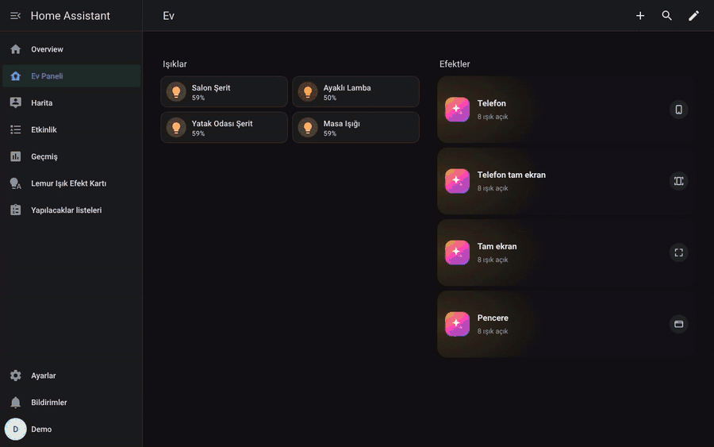

**Hızlı kurulum:** [HACS'ta aç](https://my.home-assistant.io/redirect/hacs_repository/?owner=mendebur-lemur&repository=lemur-light-effect-card&category=integration) → İndir → Home Assistant'ı yeniden başlat → [entegrasyonu ekle](https://my.home-assistant.io/redirect/config_flow_start/?domain=lemur_light_effects). Adım adım anlatım ve videolar [aşağıda](#kurulum).

- **Odalar Home Assistant alanlarından gelir.** YAML'da ışık listesi yazmana gerek yok. Her odada efektlerin hangi ışıklara gideceğini seçersin, seçim evdeki herkes için ortaktır.
- **Farklı markalar aynı odada.** Seçili ışıkların bütün efektleri görünür. Kartın altındaki noktalar o efekti kaç ışığın desteklediğini gösterir; dokununca efekt yalnızca destekleyen ışıklara gider. Aynı anlama gelen efektler tek kartta birleşir (örneğin `candle`, `Candle` ve `Candlelight` tek bir "Mum Işığı" olur).
- **Her odanın kendi sekmeleri, favorileri ve gizlenen efektleri.** Kartta bir efekte basılı tut (masaüstünde sağ tık): favorile, gizle ya da kendi simgeni yükle.
- **Her efekte özel çizilmiş simgeler.** Yüzlerce efektin her biri için aynı stilde ayrı bir simge var; bilinmeyen adlarda efektin adına en uygun simge otomatik seçilir.
- **Tek Durdur düğmesi.** Her ışığa kendi kapatma efektini gönderir, ardından ışıkları göz yormayan sakin bir beyaza alır (varsayılan 3200 K, %40).
- **Işık sekmesi:** parlaklık çubuğu, beyaz tonlar, renk çemberi ve hazır renkler.
- **Tablet ve telefon düzeni.** Telefonda her şey başparmak altında: üstte oda kutusu (bütün odalar ve kaç ışığın açık olduğu bir dokunuşta), hemen altında ne çaldığı ve Durdur, altta kalın bir parlaklık çubuğu ve Favoriler / Son çalınan / Tüm efektler / Beyaz & renk sekmeleri. Tüm efektler sekmesinde arama var. Sağa-sola kaydırınca oda değişir. Dokunuşlar anında tepki verir.
- **Dört hazır buton kartı:** telefon ekranı, telefonda tam ekran, tam ekran ve boyutu ayarlanabilen pencere. Hiçbiri browser_mod gerektirmez.
- **Kendi efektlerini oluştur.** Işıkları sürükleyip bir efekte kat, her birinin ne açacağını seç: efekti desteklemeyen ışık renk ya da beyaz açar, istediğin ışık kendi listesinden başka bir efekt oynatır.
- **Kenar menüde kontrol paneli** (*Lemur Işık Efekt Kartı*): odalar, ışıklar, sekmeler ve efektler sürükle-bırak ile düzenlenir.
- **Geniş ayarlar:** karo boyutu, renkli ya da sade simgeler, siyah (OLED) ya da tema arka planı, gece modu, açılış sekmesi, oda simgeleri ve daha fazlası. Efektler ve favoriler tek tıkla Home Assistant scripti olur.
- **Otomasyon ve sesli asistan:** her oda için efekt seçimi varlığı ve `lemur_light_effects.play` servisi.
- Türkçe, İngilizce, Almanca, İspanyolca ve Fransızca arayüz.

## İçindekiler

- [Kurulum](#kurulum)
  - [1. HACS ile indir](#1-hacs-ile-indir)
  - [2. Entegrasyonu ekle](#2-entegrasyonu-ekle)
  - [3. Kontrol panelinde odalarını düzenle](#3-kontrol-panelinde-odalarını-düzenle)
  - [4. Kartı panona ekle](#4-kartı-panona-ekle)
- [Hazır buton kartları](#hazır-buton-kartları)
- [Güncelleme](#güncelleme)
- [Sorun giderme](#sorun-giderme)
- [Ekran görüntüleri](#ekran-görüntüleri)
- [Kontrol paneli](#kontrol-paneli)
  - [Ayarlar](#ayarlar)
  - [Efekt oluştur](#efekt-oluştur)
  - [Eksik ışıkları tamamla](#eksik-ışıkları-tamamla)
- [Otomasyonlar, scriptler ve sesli asistan](#otomasyonlar-scriptler-ve-sesli-asistan)
- [Kart seçenekleri](#kart-seçenekleri)
- [Lemur ailesi](#lemur-ailesi)

## Kurulum

Gerekenler: Home Assistant 2024.1 ya da daha yeni bir sürüm ve [HACS](https://hacs.xyz/docs/use/). Başka kart, tema ya da eklenti gerekmez.

### 1. HACS ile indir

En kolay yol bu düğme. Home Assistant adresini bir kez sorar, sonra depoyu doğrudan HACS'ta açar:

[](https://my.home-assistant.io/redirect/hacs_repository/?owner=mendebur-lemur&repository=lemur-light-effect-card&category=integration)

1. Açılan pencerede **Ekle**'ye bas (depo HACS'a eklenir).
2. Sağ alttaki **İndir** düğmesine bas, sürümü seçme penceresinde tekrar **İndir**.
3. **Ayarlar → Sistem → sağ üstteki ⏻ → Home Assistant'ı yeniden başlat**. Ayarlar sayfasında "Yeniden başlatma gerekli" uyarısı da çıkar, oradan da yapabilirsin.

<details>
<summary>Düğme çalışmazsa: elle ekleme</summary>

1. Sol menüden **HACS**'ı aç.
2. Sağ üstteki **⋮** menüsü → **Özel depolar** (*Custom repositories*).
3. **Depo** alanına şu adresi yapıştır:
   `https://github.com/mendebur-lemur/lemur-light-effect-card`
4. **Tür** olarak **Entegrasyon** (*Integration*) seç ve **Ekle**'ye bas. Pencereyi kapat.
5. HACS'ın arama kutusuna **Lemur Light Effect Card** yaz, sonuca tıkla.
6. **İndir** → **İndir**, ardından Home Assistant'ı yeniden başlat.

</details>

### 2. Entegrasyonu ekle

[](https://my.home-assistant.io/redirect/config_flow_start/?domain=lemur_light_effects)

Düğmeyi kullanmıyorsan: **Ayarlar → Cihazlar ve hizmetler → Entegrasyon ekle** → "Işık" ya da "Lemur" yaz → **Lemur Light Effect Card** → **Gönder** → **Bitir**. Soru sorulmaz, evdeki ışıklar kendiliğinden bulunur.

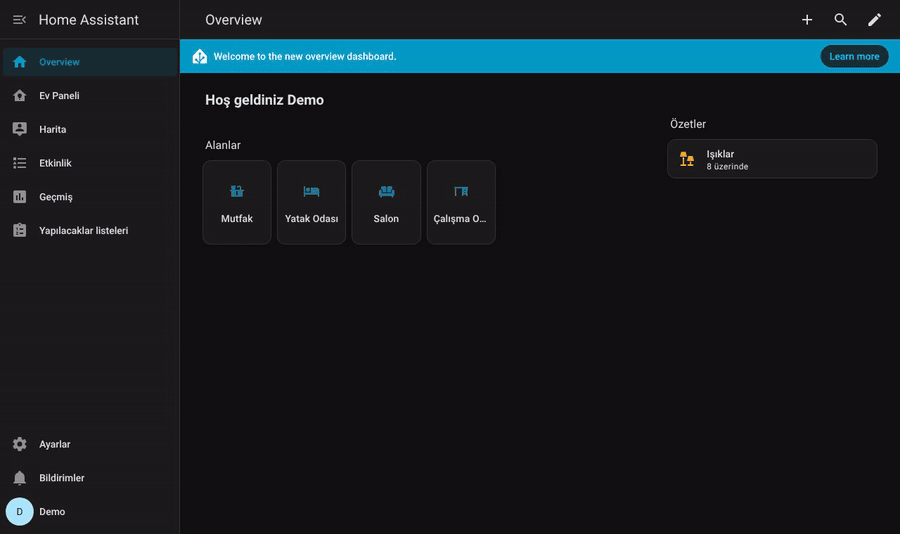

### 3. Kontrol panelinde odalarını düzenle

Sol menüde **Lemur Işık Efekt Kartı** belirir (yalnızca yöneticiler görür). İlk açılışta her oda ışıklarına göre otomatik dolar; hiçbir şeye dokunmadan da kullanabilirsin. İstersen:

- Efektleri sekmeler arasında sürükle, **Favoriler**'e bırakırsan yıldızlanır, **Gizli**'ye bırakırsan kartta görünmez.
- Bir ışığa tıkla: başka odaya taşı, kartta gizle ya da **Efektlerde kullan**'ı aç/kapat.
- Hata yaparsan **Geri al** (ya da Ctrl+Z).

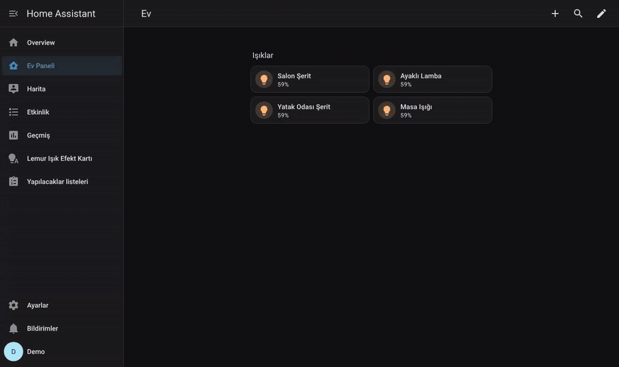

### 4. Kartı panona ekle

1. Panonu aç, sağ üstteki **✏️ (Düzenle)** düğmesine bas.
2. Bir bölümdeki **+** düğmesine bas, arama kutusuna **Lemur** yaz.
3. İstediğin kartı seç (aşağıdaki [hazır buton kartlarından](#hazır-buton-kartları) biri ya da kartın kendisi), **Kaydet** → sağ üstte **Bitti**.

Kart kendini kaydeder; *Kaynaklar* (*Resources*) menüsüne bir şey eklemene gerek yok. Videoda **Tam ekran butonu** ekleniyor:

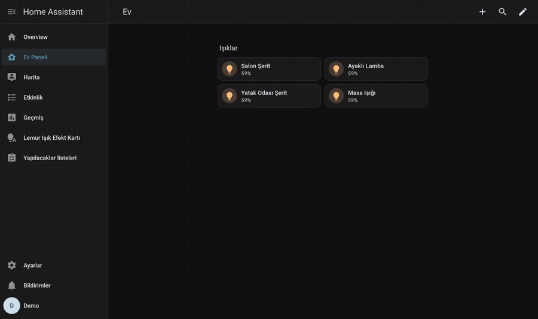

YAML ile eklemek istersen kartın kendisi:

```yaml
type: custom:lemur-light-effect-card
```

## Hazır buton kartları

Panoda küçük bir buton olarak durur, dokununca efekt ekranını açar. Dördü de browser_mod ya da başka bir eklenti olmadan çalışır; telefonun geri tuşu, Esc tuşu ve ✕ ile kapanır. Kart seçicide **Lemur Işık Efekt Kartı · …** adıyla görünürler.

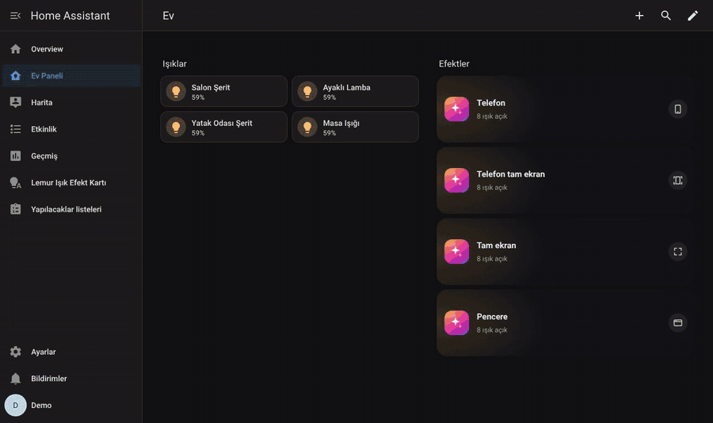

| Kart | Ne açar | Kimin için |
|---|---|---|
| **Telefon butonu** (`custom:lemur-phone-button`) | Telefona göre düzenlenmiş ekran. Telefonda bütün ekranı kaplar, geniş ekranda ortada telefon boyutunda bir pencere olur. | Telefondan hızlı kullanım |
| **Telefon tam ekran butonu** (`custom:lemur-phone-fullscreen-button`) | Telefon düzeni. Telefonda tarayıcının tam ekran modunu da açar (adres çubuğu ve sistem çubukları gizlenir), geniş ekranda ortada telefon boyutunda bir pencere olur. | Telefonda en geniş görünüm |
| **Tam ekran butonu** (`custom:lemur-fullscreen-button`) | Bütün ekranı kaplayan efekt ekranı. Tarayıcının kendi tam ekran modunu da açar, adres çubuğu ve menüler gizlenir. | Duvar tableti, tablet ve telefon |
| **Pencere butonu** (`custom:lemur-window-button`) | Boyutu, konumu ve köşeleri ayarlanabilen bir pencere. İçerik pencere boyutuna göre orantılı ölçeklenir. | Masaüstü, büyük ekranlar, özel düzenler |

Bütün seçenekler görsel düzenleyicide var. YAML örnekleri:

```yaml
type: custom:lemur-phone-button
name: Işıklar
```

```yaml
type: custom:lemur-phone-fullscreen-button
name: Işıklar
style: tile
color: purple
color_icon: aurora
```

```yaml
type: custom:lemur-fullscreen-button
name: Işık efektleri
browser_fullscreen: true
```

```yaml
type: custom:lemur-window-button
name: Işık efektleri
popup_width: 1100
popup_height: 700
popup_position: center
popup_radius: 24
popup_blur: true
popup_scale: true
aspect: 16/10
```

| Seçenek | Hangi kartta | Varsayılan | Açıklama |
|---|---|---|---|
| `name` | hepsi | Lemur Işık Efekt Kartı | Butondaki başlık |
| `subtitle` | hepsi | yanan ışık sayısı | Butondaki alt yazı |
| `hash` | hepsi | `isik-telefon` / `isik-mobil` / `isik-efektleri` / `isik-pencere` | Açıkken adrese eklenen `#...`. Bu adrese giden her bağlantı (başka bir buton, bildirim, otomasyon) ekranı açar. |
| `browser_fullscreen` | tam ekran, telefon tam ekran | `true` | Tarayıcının tam ekran modunu da aç (telefon tam ekran butonunda yalnızca telefonda) |
| `popup_width` / `popup_height` | pencere | `min(1280px,94vw)` / `min(800px,88vh)` | Pencere boyutu. Sayı yazarsan piksel sayılır; `90vw`, `70%` gibi CSS değerleri de olur. |
| `popup_position` | pencere | `center` | `center` (ortada) ya da `bottom` (alttan açılır) |
| `popup_radius` | pencere | `24` | Köşe yuvarlaklığı (px) |
| `popup_blur` | pencere | `true` | Arkadaki panoyu bulanıklaştır |
| `popup_scale` | pencere | `true` | İçeriği pencereye göre orantılı ölçekle. `false` olursa kart pencereyi normal boyutta doldurur. |
| `aspect` | pencere | `16/10` | Ölçeklemede kullanılan en-boy oranı |
| `style` | hepsi | `row` | Buton biçimi: `row` (yatay: simge, başlık, alt yazı), `tile` (kutu: büyük simge, altında başlık), `icon` (sadece simge) |
| `color` | hepsi | turuncu-mor geçiş | Buton rengi: Home Assistant renk adı (`blue`, `purple`, `primary` …) ya da `#hex` |
| `color_icon` | hepsi | – | Efekt simgelerinden renkli bir simge (örn. `aurora`, `fire`, `party`); görsel düzenleyicide listeden seçilir |
| `icon` | hepsi | – | Home Assistant simgesi (örn. `mdi:lightbulb-group`); `color_icon` seçiliyse o önceliklidir |

Biçim, renk ve simge kartın görsel düzenleyicisindeki **Görünüm** bölümünden seçilir:

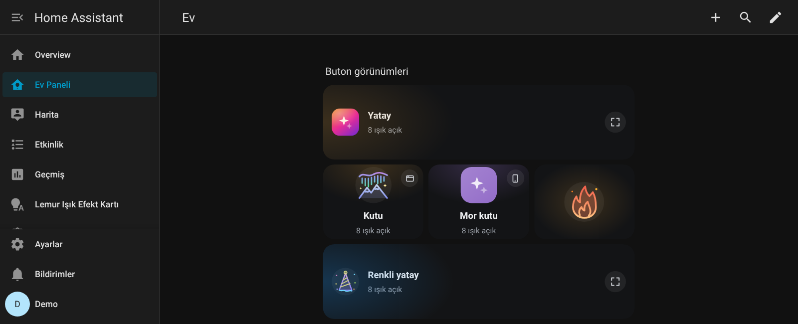

Bu kartlara [kart seçeneklerinin](#kart-seçenekleri) hepsi de yazılabilir (örneğin `areas`, `kelvin`, `accent`); açılan ekrana aktarılır.

## Güncelleme

En kolayı kontrol panelinden: **Ayarlar → Sürüm ve güncelleme → Güncellemeleri denetle**. Yeni sürüm varsa **Güncelle** HACS üzerinden indirir, ardından **Yeniden başlat** Home Assistant'ı yeniden başlatır; açılınca sayfa kendiliğinden yeni sürüme geçer.

Elle yapmak istersen:

1. **HACS → Lemur Light Effect Card → ⋮ → Bilgileri güncelle**, sonra **İndir** (ya da Ayarlar'daki güncelleme bildiriminden **Güncelle**). HACS özel depolara kendiliğinden ancak 48 saatte bir bakar; "Bilgileri güncelle" bunu beklemeden yapar.
2. Home Assistant'ı yeniden başlat.

Kart, tarayıcının ve telefon uygulamasının sakladığı eski sayfa kopyalarını kendisi temizler; eski kart bir kez gelirse sayfa bir kez yenilenir. 1.4.0'dan eski bir sürümden geliyorsan bir kereliğine bilgisayarda Ctrl+F5 yap, telefon uygulamasında **Ayarlar → Companion app → Reset frontend cache**.

Odaların, sekmelerin, favorilerin ve simgelerin güncellemede silinmez.

## Sorun giderme

- **Kart seçicide "Lemur" aratınca kartlar çıkmıyor ya da "Özel öğe yok" hatası var.** Entegrasyonun eklendiğinden ([adım 2](#2-entegrasyonu-ekle)) ve Home Assistant'ın yeniden başlatıldığından emin ol, sonra tarayıcıyı Ctrl+F5 ile yenile.
- **Sol menüde Lemur Işık Efekt Kartı yok.** Panel yalnızca yönetici kullanıcılara görünür. Kart herkes için çalışır.
- **Bir ışık efekt listesini daraltıyor ya da efektler eksik görünüyor.** Örneğin Matter ile eklenmiş ya da yalnızca beyaz tonları olan bir ışık. Kontrol panelinde o ışığa tıkla ve **Efektlerde kullan**'ı kapat. Işık renk, beyaz ton ve parlaklık için çalışmaya devam eder, efekt listesine karışmaz.
- **Bir ışık hiç görünmüyor.** Işığın Home Assistant'ta bir alana atanmış olması gerekir; alanı olmayan ışıklar panelde **Diğer** odasında toplanır, oradan istediğin odaya sürükleyebilirsin. Kartta gizlediğin ışıklar panelde **Kartta gizli** bölümündedir.
- **Tam ekran açılmıyor, sadece pencere oluyor.** Bazı tarayıcılar (örneğin iPhone'daki Safari) web sayfalarının tam ekran olmasına izin vermez; o zaman ekran yine bütün sayfayı kaplar ama adres çubuğu kalır.
- **Hâlâ çözülmedi mi?** [Sorun bildir](https://github.com/mendebur-lemur/lemur-light-effect-card/issues); Home Assistant sürümünü ve tarayıcıyı yazarsan hızlı bakarız.

## Ekran görüntüleri

| Tablet | Telefon |
|---|---|
| 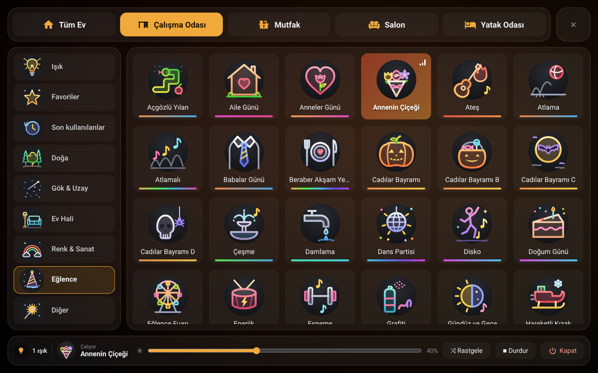 | 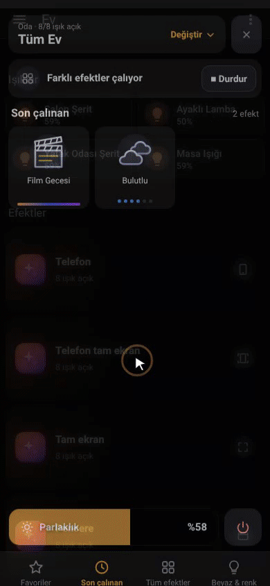 |
| 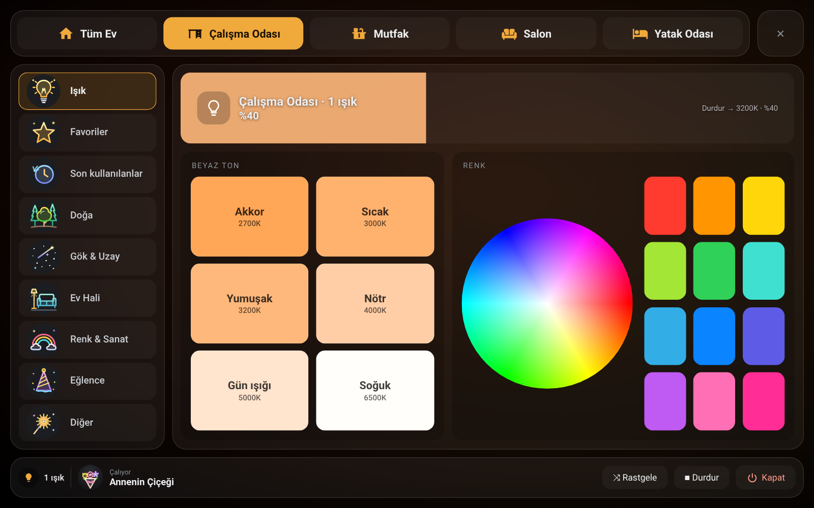 | |

## Kontrol paneli

Entegrasyonu kurunca Home Assistant'ın sol menüsüne **Lemur Işık Efekt Kartı** sayfası eklenir (yalnızca yöneticiler görür). Panel, kartın düzenleme modudur: üstte odalar, seçili odanın hemen altında o odanın ışıkları, solda sekmeler, sağda efektler. Her şey sürükle-bırak ile taşınır ve evdeki bütün kartlara uygulanır.

- **Odalar ve ışıklar:** Odalar Home Assistant alanlarından gelir. Bir ışığı başka bir odaya sürükleyebilir ya da "Işık ekle" ile seçebilirsin. "Kartta gizli"ye bıraktığın ışıklar kartta görünmez; segmentler, gösterge LED'leri ve ekranlar oraya otomatik düşer. Odaları ve "Tüm Ev"i sürükleyerek sıralarsın; Tüm Ev'i kendi şeridinden kapatabilirsin.
- **Efektlerde kullan:** Bir ışığa tıklayınca açılan menüden ışığın efektlerde kullanılıp kullanılmayacağını seçersin. Kapalı ışıklar yalnızca renk, beyaz ton ve parlaklık için kullanılır, odanın efekt listesini daraltmaz.
- **Her odanın kendi sekmeleri:** Bir odadaki sekmeler ve içlerindeki efektler yalnızca o odaya aittir. İlk açılışta her oda ışıklarına göre otomatik dolar. Efektleri sekmeler arasında sürükle, Favoriler'e bırakınca efekt yıldızlanır, Gizli'ye bırakınca o odada kartta görünmez. "Sekme ekle" boş sekme, hazır gruplar ve diğer odaların sekmelerini sunar; bir sekmeyi üstteki başka bir odaya sürüklersen kopyalanır.
- **Önizleme:** Üst çubuktaki **▶ Önizleme** anahtarını açınca tıkladığın efekt seçili odanın ışıklarında hemen çalar; efektleri art arda deneyip karşılaştırırsın. Başlarken ışıkların o anki hali kaydedilir. Şeritteki **Eski haline dön** ışıkları önizlemeden önceki haline getirir, **Böyle bırak** son efekti çalar halde bırakır. Panelden çıkınca ya da 10 dakika dokunulmazsa ışıklar kendiliğinden eski haline döner. Önizlemede çalınanlar "Son çalınan" listesine girmez.
- **Tüm efektler:** Odanın bütün efektleri tek ızgarada, hangi sekmede olduklarıyla birlikte. Ara, seç (Shift ile aralık), istediğin sekmeye sürükle. Bir efektin "⋯" düğmesinden her ışıktaki adını görür, kendi simgeni yüklersin.
- **Geri al:** Her değişiklik geri alınabilir (düğme ya da Ctrl+Z). "⋯" menüsünde odayı otomatik düzene döndürme, odayı kartta gizleme ve sekmeleri başka odalara kopyalama var.
- **Sekme adı ve simgesi:** Bir sekmeye tıklayıp adını değiştirebilir, renkli efekt simgelerinden ya da sade simgelerden birini seçebilirsin (arama kutusuyla).
- **Oda simgesi:** "⋯" menüsünden her odaya (Tüm Ev ve Diğer dahil) istediğin simgeyi verebilirsin.
- **Script olarak kaydet:** Bir efektin "⋯" menüsünden ya da Favoriler sekmesinin başındaki düğmeden, efekti oynatan Home Assistant scriptleri oluşturulur; otomasyonlarda ve sesli asistanda kullanılabilir.

### Ayarlar

Sol alttaki **Ayarlar** penceresi evdeki bütün kartlara uygulanır:

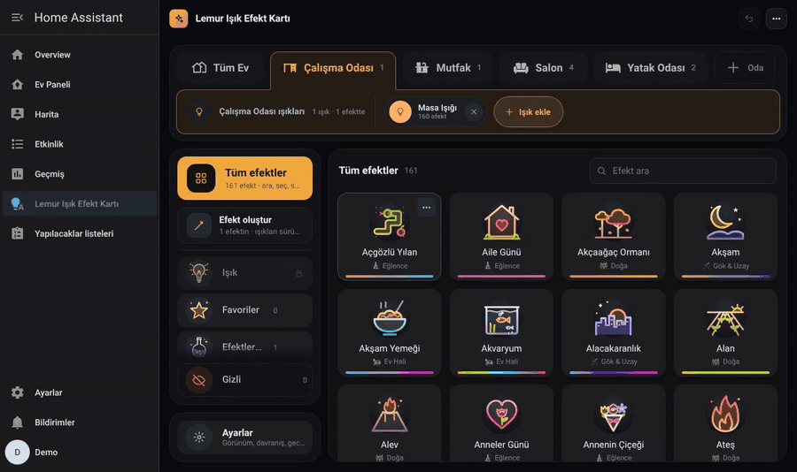

- *Görünüm:* karo boyutu (otomatik, küçük, orta, büyük), renkli ya da sade (tek renk) simgeler, arka plan (koyu, siyah OLED, Home Assistant teması), efekt adları, renk çizgisi ve destek noktaları aç/kapat.
- *Alt çubuk:* Durdur ve Rastgele düğmelerini gizleme.
- *Davranış:* kapalı bir ışığa efekt seçilince hangi parlaklıkta açılacağı, kart açılınca hangi sekmenin geleceği (son kullanılan, otomatik, Favoriler, Işık; varsayılan "son kullanılan": o cihazda en son açık olan oda ve sekme), uzun basma süresi, titreşim, geçiş süresi (renk, beyaz, parlaklık ve kapatma yumuşak geçer) ve **Son kullanılanlar** sekmesi (odada son oynatılan 12 efekt, Favoriler'in altında).
- *Durdur sonrası* beyaz ton ve parlaklık.
- *Gece modu:* seçtiğin saatler arasında parlaklık üst sınırı (efektler, Durdur ve parlaklık çubuğu bu sınırı aşmaz).
- *Odalar ve ışıklar:* Home Assistant ışık gruplarını gösterme, bir ışığın efektli sayılması için gereken en az efekt sayısı.
- *Sürüm ve güncelleme:* yüklü sürüm; yeni sürümü denetleme, HACS ile indirme ve Home Assistant'ı yeniden başlatma.
- *Yedek:* bütün düzeni (odalar, sekmeler, favoriler, kendi efektlerin, ayarlar, simgeler) tek dosya olarak indir, istediğinde geri yükle.
- *Her şeyi sıfırla:* onay sorulduktan sonra bütün düzeni, sekmeleri, favorileri, simgeleri ve kendi efektlerini siler.

### Efekt oluştur

Panelde **Tüm efektler**'in hemen altındaki **Efekt oluştur** ile kendi efektini yaparsın:

1. **Yeni efekt**'e bas, ad ve simge seç.
2. İstersen bir **temel efekt** seç (örneğin Film). Bu efekti destekleyen ışıklar onu oynatır.
3. Solda evdeki **bütün ışıklar** odalara göre listelenir. Efekte katmak istediklerini sağdaki **Bu efektteki ışıklar** alanına sürükle (ya da + ile ekle, "Hepsini ekle" ile bütün odayı al).
4. Sağdaki her ışık için ne açacağını seç: **Otomatik** (temel efekti destekliyorsa onu, desteklemiyorsa üstte seçtiğin rengi ya da beyazı), kendi listesinden başka bir **efekt**, **renk**, **beyaz** ton ya da **kapat**; renk ve beyazda parlaklıkla birlikte.

Kaydedince kartta **Efektlerim** sekmesinde normal bir efekt gibi görünür; dokununca sadece eklediğin ışıklar kendine düşeni yapar. Oluşturduğun efektleri listeden sürükleyip istediğin sekmeye de taşıyabilirsin.

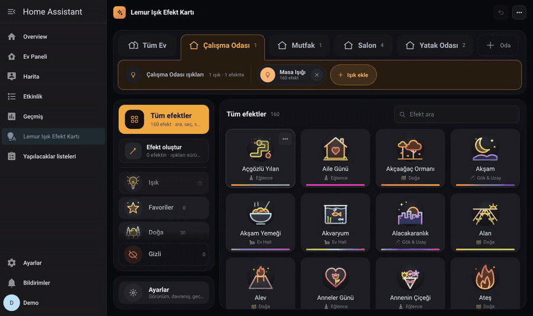

| Oda düzeni | Tüm efektler |
|---|---|
| 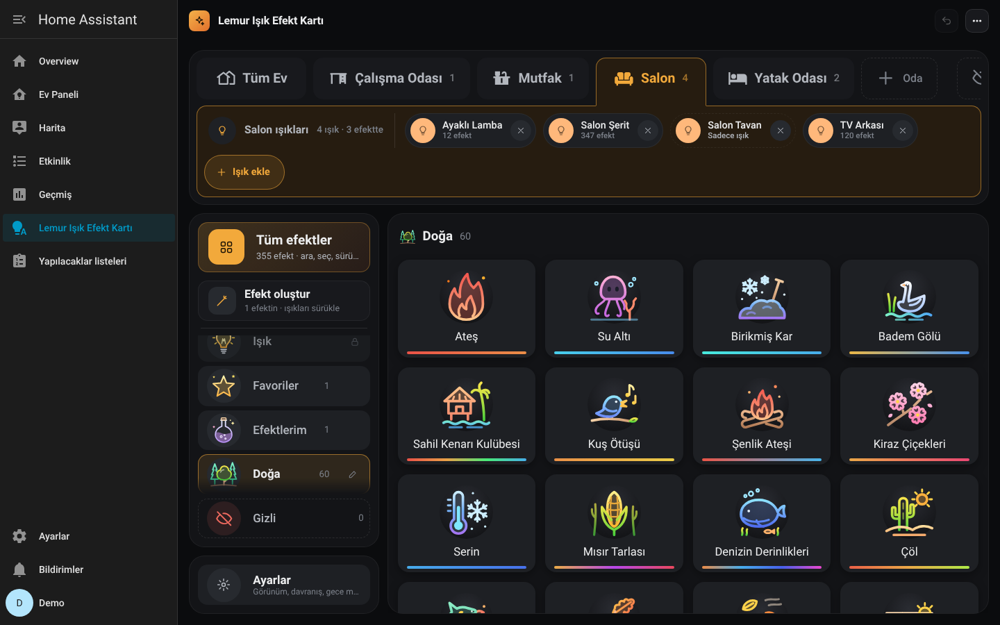 | 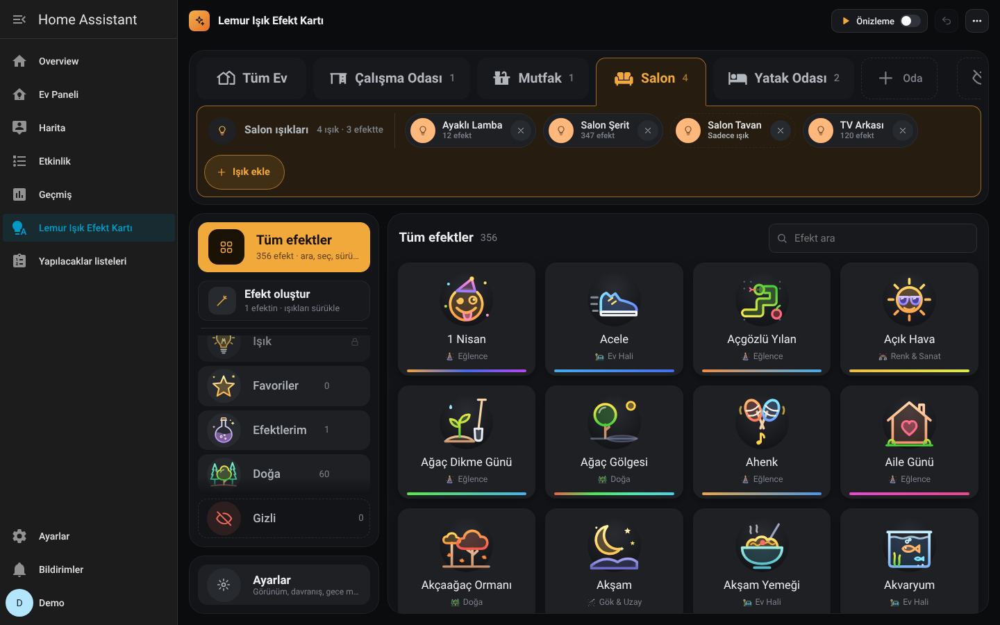 |
| **Ayarlar** | **Efekt oluştur** |
| 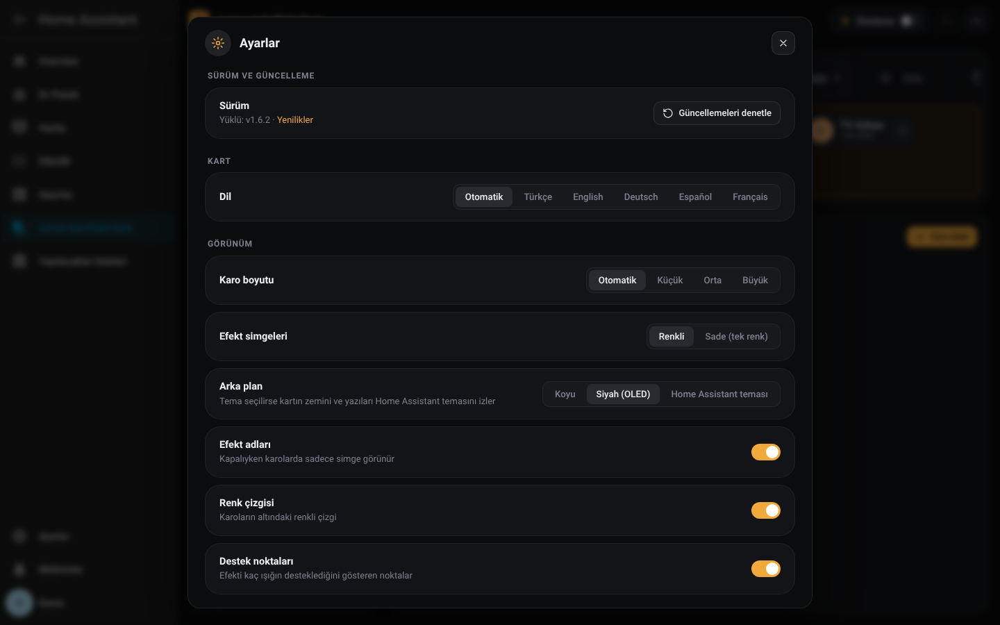 | 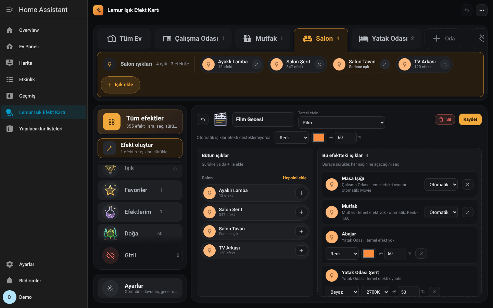 |

### Eksik ışıkları tamamla

Bir efekti odadaki ışıkların yalnızca bir kısmı destekliyorsa, desteklemeyen ışıklara ne yapacaklarını söyleyebilirsin. Efekt böylece yarım kalmaz, bütün odayı kaplar.

1. Kartta efekte sağ tıkla (telefonda basılı tut) ve **Eksik ışıkları tamamla**'ya bas. Kontrol paneli o efektin tamamlama ekranıyla açılır. Aynı ekrana paneldeki efektin ⋯ menüsünden de girilir.
2. Üstte efekti destekleyen ışıklar, altta desteklemeyenler oda oda listelenir.
3. **Hepsi için** satırında bir seçim yap: **renk**, **beyaz**, ışığın kendi listesinden başka bir **efekt**, **kapat** ya da **dokunma**. İstediğin ışığı ayrıca değiştirebilirsin. Sonra **Kaydet**.

Efekti açınca destekleyen ışıklar efekti oynatır, diğerleri senin seçtiğini yapar. Tamamlanan efekt kartta tam efekt gibi görünür, köşesinde küçük bir ✓ olur. Efekt seçimi varlıkları ve `lemur_light_effects.play` servisi de aynı kuralı kullanır. Bu ekran yalnızca yönetici hesabında açılır.

Kartta **Bazı ışıklarda** bölümündeki efektler, en çok ışıkta çalışandan en aza doğru sıralanır.

## Otomasyonlar, scriptler ve sesli asistan

Her oda için bir **efekt seçimi** varlığı oluşur (`select.lemur_salon_effect` gibi; Tüm Ev için `select.lemur_home_effect`). Odada o an çalan efekti gösterir, listeden seçince efekt oynar, `—` seçilince Durdur gibi davranır. Panolarda, otomasyonlarda ve sesli asistanlarda (Assist, Google, Alexa) kullanılabilir. Efekt listesinde ışığın verdiği adlar ve kendi efektlerin vardır; efektin kartta görünen adı da kabul edilir.

Servisler:

```yaml
action: lemur_light_effects.play
data:
  room: salon            # alan kimliği ya da kartta görünen oda adı; _all = Tüm Ev
  effect: Film Gecesi    # ışıktaki adı, kartta görünen adı ya da kendi efektinin adı
  brightness: 60         # isteğe bağlı, %
  transition: 2          # isteğe bağlı, saniye
```

```yaml
action: lemur_light_effects.stop
data:
  room: salon
```

`lemur_light_effects.list_effects` (yanıt döndürür) bir odanın oynatabildiği efektleri ve şu an çalanı verir. Kart nasıl davranıyorsa servisler de öyle davranır: odada seçili ışıklar, gizlenen efektler, gece modu ve "kapalı ışık şu parlaklıkta açılsın" ayarı geçerlidir.

## Kart seçenekleri

Bütün seçenekler görsel düzenleyicide de var. Kontrol panelindeki ayarlar bunların varsayılanını belirler; karta yazdığın değer önceliklidir.

| Seçenek | Varsayılan | Açıklama |
|---|---|---|
| `areas` | ışığı olan tüm alanlar | Gösterilecek alan ID'leri, bu sırayla |
| `exclude` | – | Dışarıda bırakılacak ışıklar |
| `entities` | – | Yalnızca bu ışıkları kullan (alan taramasını geçersiz kılar) |
| `kelvin` / `brightness` | `3200` / `40` | **Durdur** ve güç düğmesinin geçeceği beyaz |
| `all_home` | `true` | "Tüm Ev" sekmesini göster |
| `min_effects` | `3` | Bir ışığın efekt listesine girmesi için gereken en az efekt sayısı |
| `language` | `auto` | `auto`, `tr`, `en`, `de`, `es`, `fr` |
| `height` / `mobile_height` | `80vh` / `80vh` | Kart yüksekliği |
| `mobile` | otomatik (< 640 px) | Telefon (`true`) ya da tablet (`false`) düzenini zorla |
| `close` | `false` | Kapatma düğmesi göster (başka bir eklentinin açılır penceresi içinde kullanıyorsan) |
| `accent` | `#F0A93B` | Vurgu rengi |
| `include_groups` | `false` | Işık gruplarını da listele |

Gizli, kategori atanmış ve grup ışıkları otomatik atlanır.

Ortak veriler (oda sekmeleri, favoriler, oda seçimleri, gizlenen efektler, son efekt, son kullanılanlar, simgeler) `.storage/lemur_light_effects` içinde, yüklenen simgeler `config/lemur_light_effects_icons/` klasöründe tutulur. Entegrasyon olmadan kartı düz kaynak olarak da yükleyebilirsin (`/lemur_light_effects/lemur-light-effect-card.js` ya da `/local` altındaki bir kopya; `lemur-icons.json` dosyasını da yanına kopyala); bu durumda veriler yalnızca o tarayıcıda saklanır.

## Efektler nasıl gruplanıyor?

Panelde henüz düzenlenmemiş bir odada efekt adları sadeleştirilip küçük bir eş anlamlılar tablosuyla eşleştirilir, sonra anahtar kelimelere göre Doğa, Gök & Uzay, Ev Hali, Renk & Sanat, Eğlence ve Diğer kategorilerine ayrılır. Yaygın sahne adlarının Türkçe karşılıkları ve renkleri hazır bir tablodan gelir. "off", "none", "stop" ya da "solid" gibi adlar *efekt yok* sayılır.

## Lemur ailesi

Üçü de birbirinden bağımsız kurulur; birlikte kurulunca birbirini tamamlar.

| | Ne yapar | Kurulum |
|---|---|---|
| **[Lemur Home Dashboard](https://github.com/mendebur-lemur/lemur-home-dashboard)** | Tek satırla kurulan, kendi yönetim paneli olan hazır tablet panosu. Odalar, ışıklar, senaryolar, iklim ve medya evdeki alanlardan kendiliğinden gelir. Kuruluysa panonun üst şeridine Efektler düğmesi gelir, senaryo bölümlerine efekt düğmeleri eklenebilir. | [](https://my.home-assistant.io/redirect/hacs_repository/?owner=mendebur-lemur&repository=lemur-home-dashboard&category=integration) |
| **Lemur Light Effect Card** (bu depo) | Efekt destekleyen bütün ışıkları oda oda yöneten efekt ekranı. | [](https://my.home-assistant.io/redirect/hacs_repository/?owner=mendebur-lemur&repository=lemur-light-effect-card&category=integration) |
| **[Lemur Halo Cards](https://github.com/mendebur-lemur/lemur-halo-cards)** | Durumu renkli haleyle anlatan sekiz kart: iklim, sensör, hava, süpürge, enerji, güvenlik, ışık ve kilit. | [](https://my.home-assistant.io/redirect/hacs_repository/?owner=mendebur-lemur&repository=lemur-halo-cards&category=plugin) |

## Geliştirme

```bash
python3 build.py          # src/ klasörünü custom_components/.../frontend/ içine paketler
pytest                    # entegrasyon testleri (pytest-homeassistant-custom-component)
```

## Lisans

Kod **[PolyForm Noncommercial 1.0.0](LICENSE)** lisansıyla yayınlanır: kişisel, ev, eğitim ve kâr amacı gütmeyen kullanım serbest; **ticari kullanım yasak**. Kodu kopyalayan, değiştiren ya da üzerine geliştirip paylaşan herkes lisans metnini ve `Required Notice` satırını (mendeburlemur ve bu deponun bağlantısı) korumak zorundadır.

Görseller, videolar ve dokümanlar **[CC BY-NC-SA 4.0](LICENSE-DOCS.md)** lisansıyla yayınlanır: kaynak göstererek, ticari olmayan amaçla ve aynı lisansla paylaşılabilir.

Ticari kullanım için izin istersen [bir issue aç](https://github.com/mendebur-lemur/lemur-light-effect-card/issues). v1.5.0 ve önceki sürümler MIT lisansıyla yayınlanmıştı; o sürümler için MIT geçerli kalır.
